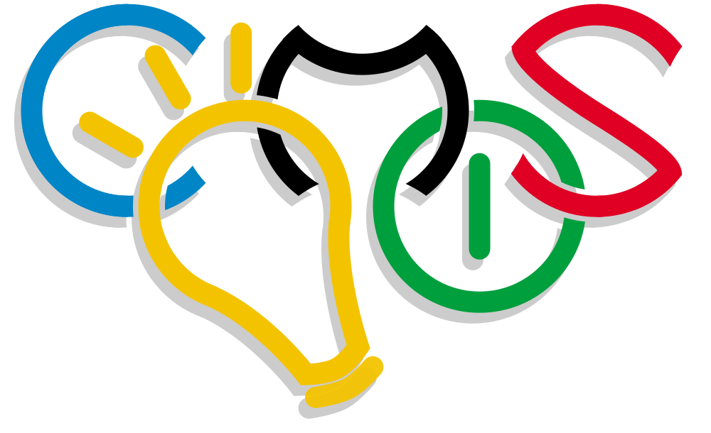

# Contest Management System

{ width="400" align="right" .off-glb }

CMS, or Contest Management System, is a distributed system for running and (to
some extent) organizing a programming contest.

CMS has been designed to be general and to handle many different types of
contests, tasks, scorings, etc. Nonetheless, CMS has been explicitly build to be
used in the 2012 International Olympiad in Informatics, held in September 2012
in Italy.

## Stable version: 1.5.1

[:material-download: Download .tar.gz](https://github.com/cms-dev/cms/releases/download/v1.5.1/v1.5.1.tar.gz){ .md-button }
[:simple-github: View on GitHub](https://github.com/cms-dev/cms/tree/v1.5){ .md-button }
[:simple-readthedocs: Read the docs](https://cms.readthedocs.io/en/v1.5){ .md-button }

## Development version

[:simple-github: View on GitHub](https://github.com/cms-dev/cms){ .md-button }
[:simple-readthedocs: Read the docs](https://cms.readthedocs.io/en/){ .md-button }

---

## Stay informed

You can subscribe to
[contestms-announce@googlegroups.com](https://groups.google.com/g/contestms-announce)
to receive announcements of new releases and other important news.

## Please, help us help you!

Have you ever wanted to give us your opinion about CMS and let us hear your
voice? Now it's the time!

You can fill [this form](http://goo.gl/7PRmHW) to let us know about you and your
general opinion on CMS, and [this other form](http://goo.gl/atFJtw) to let us
know about specific contests you ran with CMS (you can fill this second form
several times for different contests).

## Support

To learn how to install and use CMS, please read the documentation, available at
<https://cms.readthedocs.io/>.

If you have questions or need help troubleshooting some problem, [contact
us](./contact.md).
