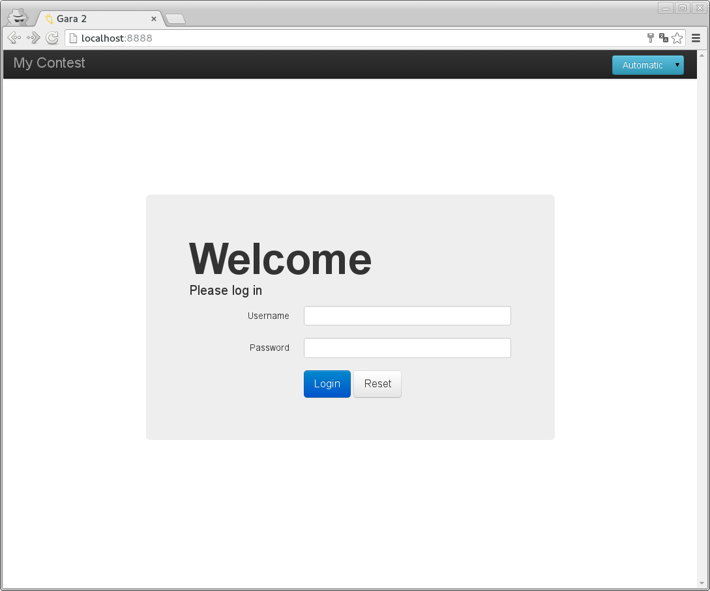
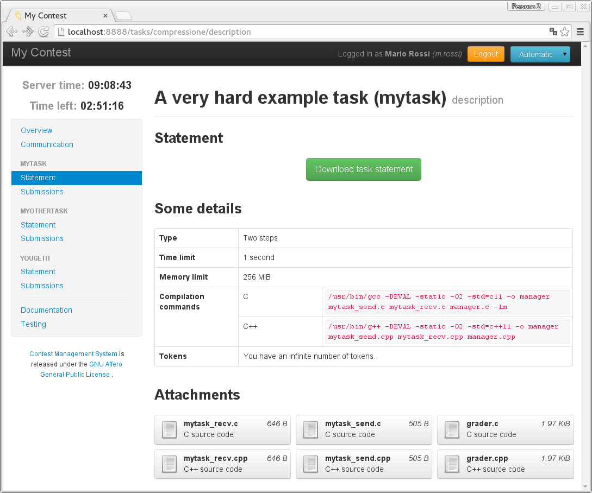
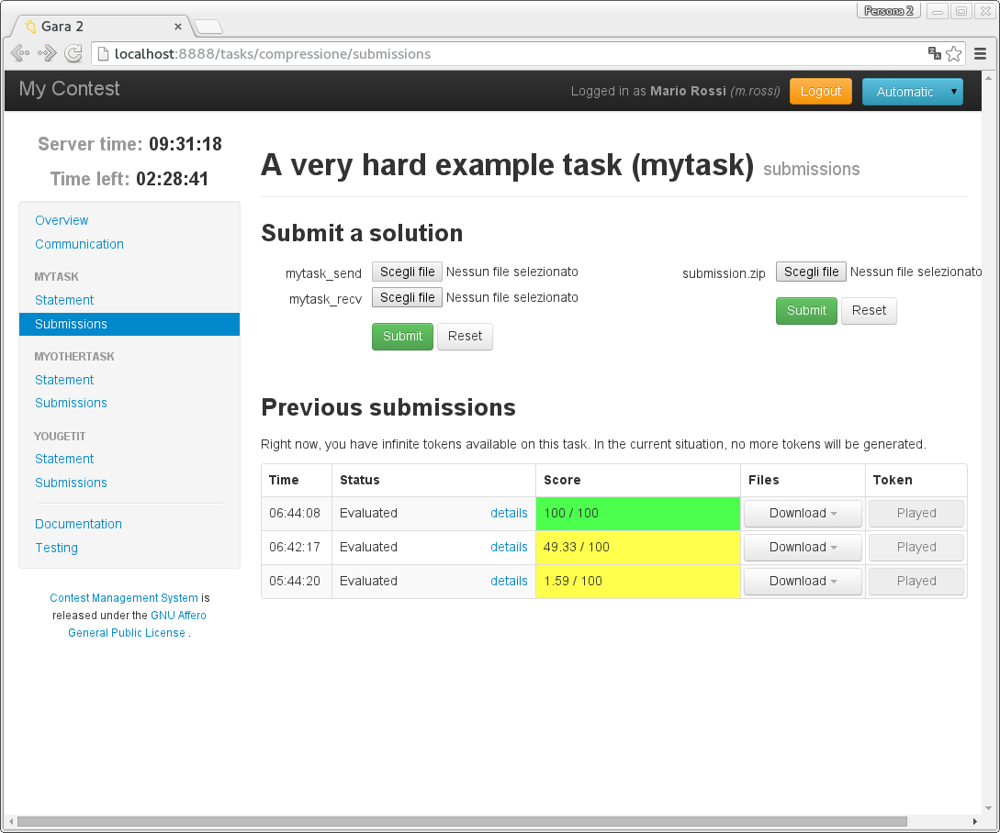
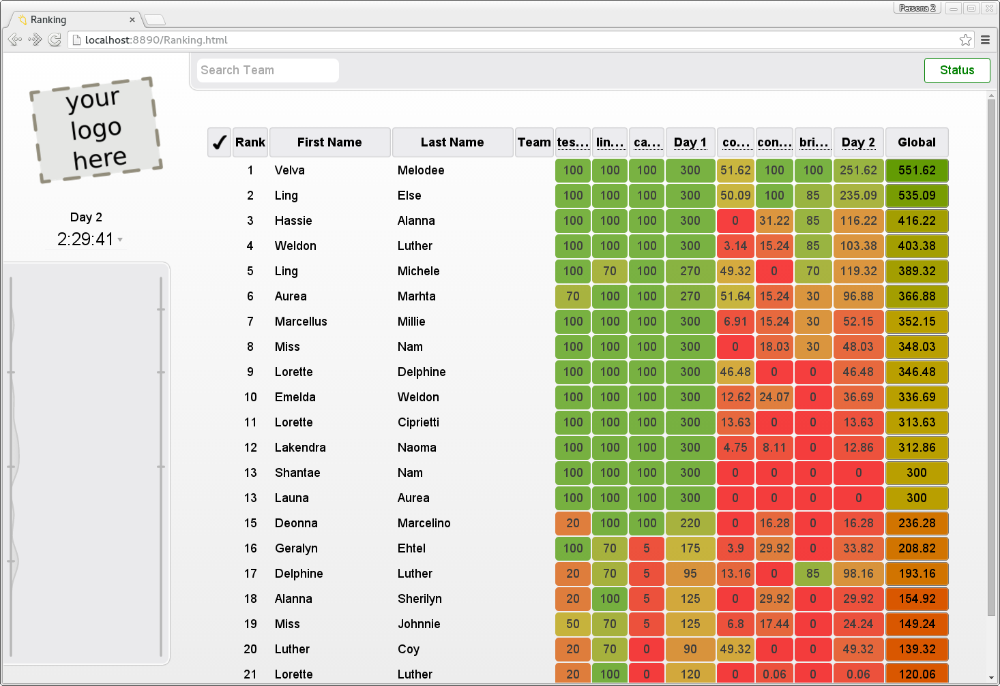
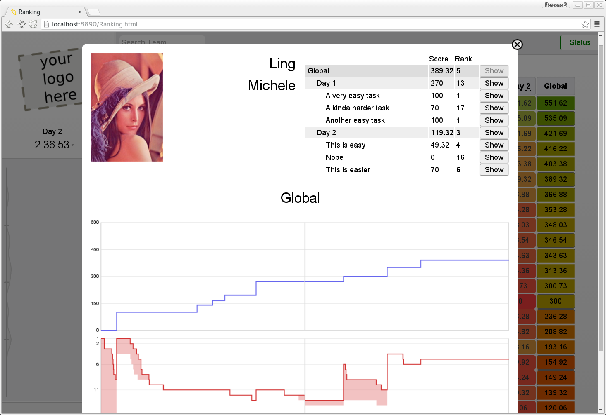
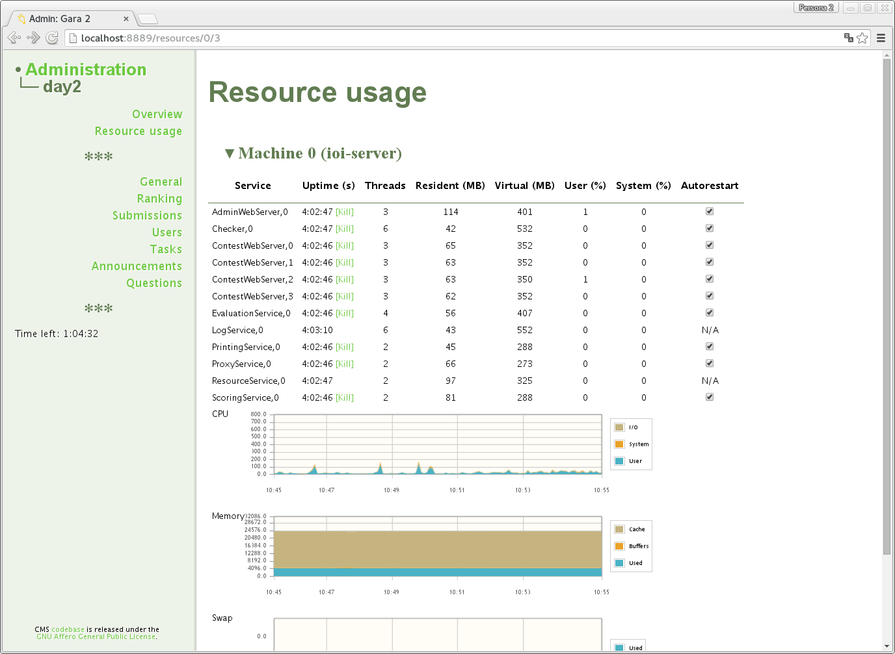
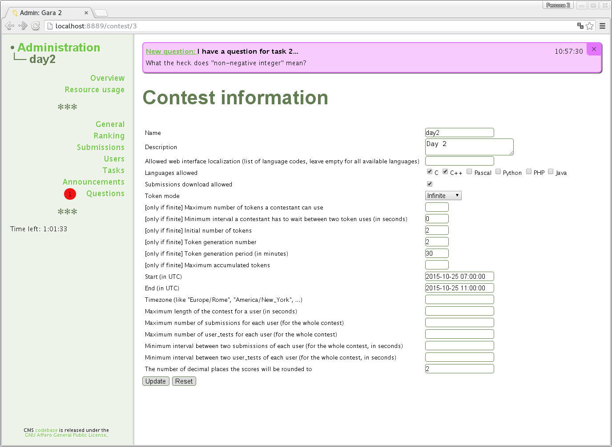
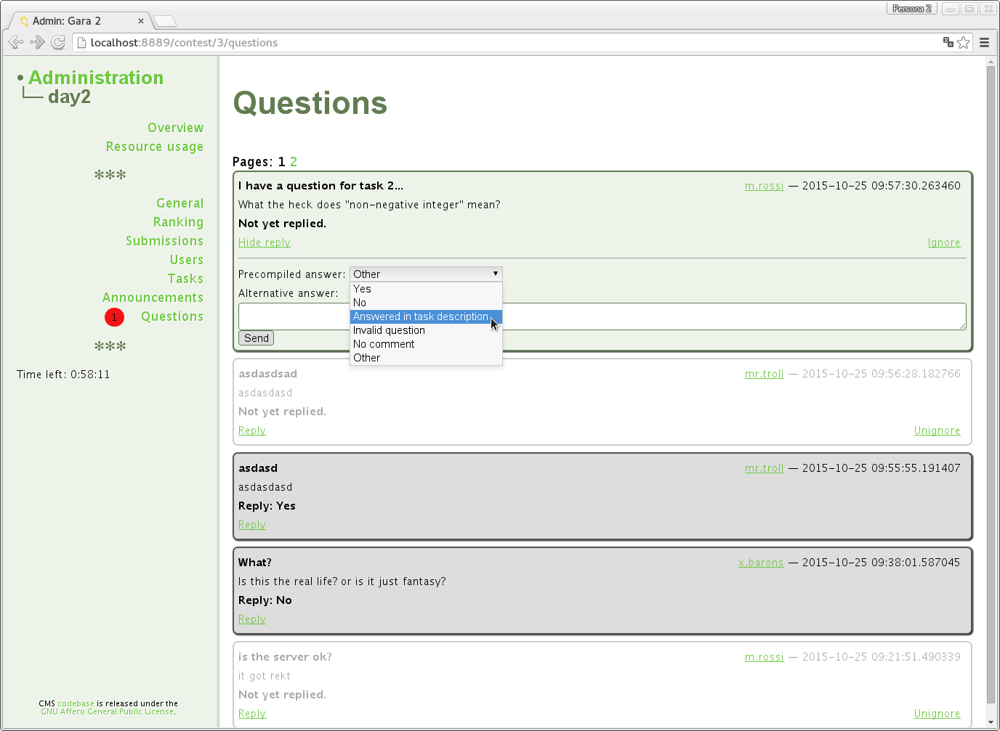

## Contestant interface

{ align=left width="250" data-title="The login page presented to the contestant. In the upper-right corner there is a language selector." }

{ align=left width="250" data-title="The task view, where the statement can be downloaded. It's possible to set up attachments for a task (e.g. to show a sample implementation to the contestant)." }

{ align=left width="250" data-title="The submission view, where files can be submitted. This specific task is a TwoStep kind of task (like IOI2011's parrots), so the contestant must send two files (or a single archive containing two files)." }

## External scoreboard

{ align=left width="250" data-title="The ranking page presented as seen by contest spectators. The clock shows that the contest has started about 2.5 hours ago. It's possible to show the remaining time by clicking on the clock." }

{ align=left width="250" data-title="When you click on a row in the ranking page, a summary of the contestant's activity pops up." }

## Admin interface

{ align=left width="250" data-title="The admin page of a single contest. You can see that there's an evaluation enqueued, and that the 4 available workers are busy running different testcases." }

{ align=left width="250" data-title="The 'Resource usage' page lets you monitor which services are up and lets you analyze how many resources they are consuming." }

{ align=left width="250" data-title="This is the notification that the admins see when a contestant asks a question during a contest." }

{ align=left width="250" data-title="As shown here, the admin can decide to write an extended answer or just use a precompiled one." }

